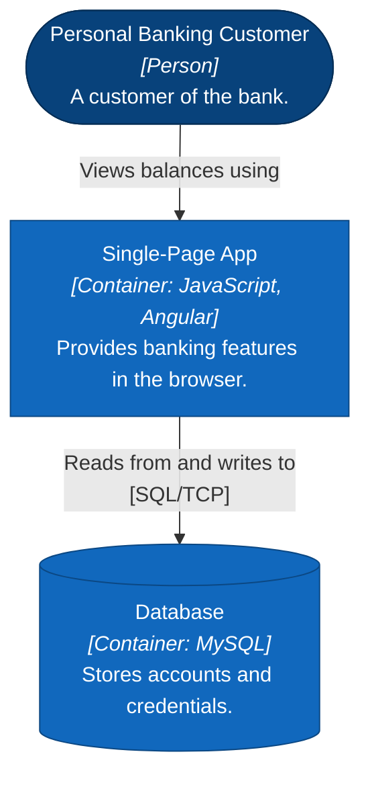

# C4 Model Diagrams (Mermaid)

The C4 model (by Simon Brown) brings structure to ad-hoc "boxes and arrows" architecture diagrams. Its power is **a small set of shared abstractions** plus **a hierarchy of diagrams** that let you zoom in and out like a map — telling different stories to different audiences at different levels of detail.

Your job with this skill is to produce clear, faithful C4 diagrams in Mermaid, and to get the *abstractions* right before worrying about how they render.

## The mental model, in one paragraph

A **software system** is made up of one or more **containers** (separately deployable/runnable applications and data stores), each of which contains one or more **components** (groupings of related code behind an interface), which are implemented by **code** elements (classes, functions). **People** (roles/actors) use software systems. Diagrams mirror this hierarchy: *system context → container → component → code*, plus three supporting diagrams (*dynamic*, *deployment*, *system landscape*).

## Step 1 — Get the abstractions right

*Done when every thing you will draw is classified as a person, software system, container, or component, and each classification survives the heuristics below.*

Before drawing anything, classify each thing you'll show. Ambiguity here is the root cause of bad diagrams. Use these definitions and heuristics:

| Abstraction | What it is | Heuristic |
|---|---|---|
| **Person** | A human user, modeled by their role/persona | "Who uses this, and to do what?" |
| **Software System** | The highest level of value delivery. Your system, *and* external systems it depends on. Treat externals as **opaque boxes you can't see inside**. | Usually one system = one team's ownership boundary / one thing deployed together. |
| **Container** | A separately deployable/runnable **application or data store** (web app, SPA, mobile app, API, serverless function, shell script; database schema, blob store, file system, **message queue/topic**). | "Is it a runtime process or a data store with isolation from others?" Communication between containers is out-of-process/network. |
| **Component** | A grouping of related code behind a well-defined interface, running **inside** a container. Not separately deployable. | "Containers contain components." All components in a container share one process. |
| **Code** | Classes, interfaces, functions inside a component. | Rarely diagrammed — the code already shows this. |

**Critical heuristics** that catch most modeling mistakes:

- **"Can these technologies run in the same OS process?"** If you find yourself labeling one container "Java and MySQL", it's wrong — Java needs a JVM, MySQL needs a database server. That's two containers, not one.
- **A microservice is usually *not* a single container.** If it's an API + its own database schema, that's *two containers* (optionally grouped with a boundary box). Model a microservice as a **group of containers** when it lives inside one team's system, or as a **software system** when a separate team owns it. See `references/advanced-patterns.md`.
- **Message queues/topics are data-store containers**, not a "message bus" software system. Model each queue/topic as its own data-store container (a subroutine-shaped `[[ … ]]` node). This reveals the real producer→consumer coupling. See `references/advanced-patterns.md`.
- **External vs. integral.** An external SaaS you merely call (e.g. an email API) is a *software system*. A cloud store whose contents/organization you own (e.g. an S3 bucket that's part of your system) is a *container*, even though a third party hosts it.
- Things that are **not** software systems: product domains, DDD bounded contexts, business capabilities, feature teams/squads. Those are *groupings* overlaid on the abstractions, not abstractions themselves.

## Step 2 — Draw the core three, then ask about the rest

*Done when L1, L2, and L3 exist and the user has answered every choice you put to them: which container to open, each supporting diagram, any feature worth decomposing.*

This step covers a request to diagram a system or its architecture. Two other requests reach this skill and take a different path:

- **A specific diagram was asked for** — "show me the deployment", "diagram how login works". Draw that one. Then say which of the core three are missing and offer them, rather than producing them unasked.
- **An existing diagram is under review** — skip to the review checklist near the end of this file.

**The core set is L1 Context, L2 Container, and L3 Component.** Draw all three every time. Together they carry the zoom from "who uses this and what does it touch" down to "what is inside one container", which is the story a reader needs.

- **L1 — System Context.** One box for the system in focus, surrounded by the people and external systems it interacts with. Audience: everyone, technical or not. Ages slowly. Show the *functional* users, the people pursuing a business goal; put admin and ops staff in only where they use something built for them, such as an admin UI, or give them their own version of the diagram. Drawing it settles what sits inside the system boundary and what sits outside, so it doubles as the scoping tool for the other two.
- **L2 — Container.** Zoom into the system: its deployable applications and data stores, what each is responsible for, the significant technology choices, and the protocol on every link between them. Audience: technical, plus ops, QA, and security review. Ages slowly. This is the main integration view.
- **L3 — Component.** One diagram per container, showing the components inside it. Not one per feature: the whole container on one canvas is what lets a reader see how the parts relate.

  **Open only a container whose source you have.** Inside a mobile app repo that is the app, not the API it calls: an external system's internals stay opaque, and guessing at them produces a diagram that reads as authoritative and is fiction.

  **More than one container with source? Ask.** A monorepo holding an app, an API, and a worker has no single right answer. List the candidates with your recommendation and let the user pick, using `AskUserQuestion` as you do for the supporting diagrams.

  **Features are the components.** Where the source has a `features/` folder, each feature is one component. Name it after the responsibility it carries and put its path in the type line for orientation — `Lot [Component: src/features/lot]` — then describe what it holds: *"Lot detail, gallery and rich media, cost calculator, condition report, following and the timed bidding flow."* The folder shows you where the seams are. It does not dictate the component's name, and its subfolders are not components.

  **Decompose only the features that need it.** A feature carrying several distinct responsibilities that collaborate, on boundaries still true next month, earns more than one component. Everything else stays a single **composed** component, with its parts named in its description rather than drawn as boxes. Most features stay composed — decomposing every one produces a diagram nobody reads, and the parts churn faster than the feature does.

  **Supporting layers are components too**, sitting beside the features: routing, shared UI, data access, capability facades, real-time clients, WebView hosts, native bridges. Each gets its path in the type line and its responsibility in its description. Style them distinctly from the features, so a reader sees the two ranks at a glance.

  **Group the features when there are many.** Nested subgraphs by concern — entry, browse, transactional — keep eight features legible inside the container boundary. Draw shared edges from the group as a whole, and per-feature edges only where one feature depends on something the others don't.

  Data stores and external systems stay outside the container boundary, so the diagram shows the container's reach without pretending to own them.

  With no feature seam in the tree, slice by responsibility instead — one request path or use case — and name components after what they do rather than after their layer.

### Then ask about the supporting diagrams

The remaining diagrams earn their keep only sometimes, and each one costs maintenance. Once the core three are drawn, **ask the user which of these to add** — use `AskUserQuestion` with them as multi-select options, give your recommendation for this particular system, and draw only what they pick.

| Optional | What it adds | Recommend it when |
|---|---|---|
| **Deployment** | How container instances map onto infrastructure, one diagram per environment | The system runs in more than one environment, or production topology matters to the reader. Worth recommending for most deployed systems |
| **Dynamic** | How one feature works at runtime, as a subset of elements collaborating | A flow is interesting, recurring, or complicated enough that the container view can't convey its order |
| **L4 — Code** | Class and function detail inside one component | Almost never. The code already shows this, and it ages fastest of all. Offer it only for a component whose design is genuinely hard to grasp from the source |

Keep deployment detail *off* L2 and on the deployment diagram, since it varies per environment.

Give each answer a real recommendation rather than a neutral list — you have just modelled the system and know which of these would tell the reader something the core three don't.

## Step 3 — Render it in Mermaid

*Done when every diagram renders, carries its title, and is followed by its key.*

Mermaid ships an experimental native C4 mode, but its auto-layout is unreliable and many renderers draw it incorrectly or not at all. **Render each C4 level as a styled `flowchart` instead** — you carry the C4 method by hand and get output that renders everywhere.

[`references/mermaid-flowchart-c4.md`](references/mermaid-flowchart-c4.md) holds the element, relationship, boundary, and layout conventions plus a worked example of every diagram type. **Read it before drawing.** The shape it teaches:



| Notation | Meaning |
|---|---|
| Dark blue | Container inside the system in focus |
| Stadium shape | Person |
| Cylinder | Data store |

Every element carries `Name`, `[Type]`, and a responsibility; every edge label reads as a sentence ending on a preposition; the protocol rides on inter-container edges only. Shape signals the abstraction, colour signals internal versus external, and the key table below the diagram explains both.

Control layout with the direction (`TB` or `LR`), node ordering, and invisible edges (`a ~~~ b`).

## Step 4 — Deliver the diagram, not a description of it

*Done when every diagram is written to a markdown file under `docs/`, each with its title and key, and every sentence you added carries something the diagram cannot.*

**The output is always markdown files under `docs/`.** A diagram pasted into a chat reply is gone by tomorrow; the deliverable is a file in the repo that reviews, diffs, and renders wherever the team reads markdown. Write it, then tell the user the path.

- **The document always lives at `docs/architecture.md` in the repo root**, with L1, L2, and L3 as sections in that one file, in order. One known path, so the next reader and the next agent find it without searching, and a reader following the zoom from context to components gets them together.
- **Supporting diagrams go in the same file** under their own heading, unless one grows enough to stand alone — a deployment diagram per environment is the usual case for splitting out.
- **Follow the repo where it already keeps its docs somewhere else** (`documentation/`, `doc/`): write there, tell the user the document belongs at `docs/architecture.md`, and move it only if they say so. Either way match the siblings' conventions — frontmatter fields, heading depth, file naming. Create the directory only as you write the first file into it.
- **Extend, never overwrite.** If the file exists, read it and replace the section for the level you redrew, leaving the rest intact.
- Diagrams go in ```` ```mermaid ```` fences so they render in place, each followed by its key table.

**The diagram is the deliverable.** Information belongs inside it — in the node text and on the arrows — where a reader meets it in context. The same information repeated in a paragraph underneath costs them a second read and goes stale separately.

So the file holds the diagram, its title line, and its key table, and stops there. In particular, skip:

- A node-by-node or arrow-by-arrow walkthrough. If a reader needs a sentence to understand an element, that sentence belongs in the element's description line.
- A restatement of what the diagram shows ("the mobile app calls the API, which reads from the database").
- A preamble explaining what a C4 level is, or which level this is. The title says it.
- A summary of your own process, or a list of what you decided not to draw beyond the questions you actually need answered.

Prose earns its place only where the notation cannot reach:

- **Assumptions you had to make** to model something, and the specific question that would settle each one.
- **What you deliberately left out**, where a reader would otherwise assume the diagram is complete — an out-of-scope system, a container you collapsed.
- **The why**, which no diagram carries. Point at an existing `ADR-NN`, or offer to draft one, rather than explaining the reasoning inline.

A few lines of that beats several paragraphs of narration. In the chat reply, give the path and what changed — the file carries the rest.

## What makes the diagram *good* (not just correct)

The single biggest lever is **add more words** — inside the elements, never in a paragraph beside them. Most bad diagrams are just named boxes. For every element, put inside it:

- **Name** — what it's called.
- **Type** — the abstraction, e.g. `[Software System]`, `[Container]`. Write it into the node text yourself (the flowchart won't add it) — e.g. an italic `<i>[Container: Java, Spring Boot]</i>` line.
- **Technology** — for containers/components, the 1–2 most significant choices (e.g. "Java, Spring Boot"). Optional major version if upgrades are painful.
- **Description** — a short sentence (or ≤7 bullets) on its responsibility.

For every **relationship**:

- **Label every arrow** with intent, and make it read as a sentence. **End with a preposition** ("Makes API calls **to**", "Reads **from**") so the arrow direction is unambiguous.
- **Arrows are unidirectional.** Collapse a request/response pair into one arrow from the initiator to the receiver. Only draw two arrows when the two interactions genuinely differ (e.g. sync API request + async event).
- **Add technology** to inter-container arrows (the protocol: JSON/HTTPS, gRPC, SQL/TCP). Component-to-component in-process calls usually need no tech.
- **Pick an arrow meaning and stay consistent.** Request-driven systems read best with *dependency* arrows (initiator → receiver); message/event-driven systems read best with arrows showing the *flow* of messages/events. Pick one meaning and hold it across the whole diagram.
- **Line style can carry a second signal:** solid for synchronous, dashed for asynchronous is a common convention. If you use it, put it in the key. Avoid relying on different *arrowheads* — the distinctions vanish when zoomed out.

Then:

- **Title every diagram** with its *type* and *scope*, e.g. "Container diagram for Internet Banking System". So it stands alone when pulled out of context.
- **Follow every diagram with a key**, as a Markdown table directly beneath it, covering each colour, shape, line style, and icon you used to *differentiate* things. Keep it out of the diagram: a legend `subgraph` competes with the real elements for layout and lands wherever the renderer puts it, while a table stays where you wrote it and survives a narrow screen.

  | Notation | Meaning |
  |---|---|
  | Dark blue | The system in focus |
  | Grey | External system |
  | Dashed edge | Asynchronous communication |
- **Be consistent across the set.** Same element = same name, same notation, same placement (e.g. people at the top) on the context *and* container diagrams.
- **Keep deployment details off** context/container diagrams — they belong on a deployment diagram (they vary per environment).
- **Expand or gloss code names/acronyms.** "Plutus (payment service)" beats a wall of Greek names to a newcomer. (Common technical abbreviations — HTTP, JSON, SQL — are fine as-is for a technical audience.)
- **Keep elements roughly the same size.** Readers assume a bigger box means bigger/more-complex/more-important. Only vary size if you *mean* to say that.
- **Layout consistency across the set.** If people are at the top of the context diagram, keep them at the top of the container diagram. Same element → same name, notation, and placement everywhere it appears.

## Review checklist (use when critiquing any diagram)

Ask these; each "no" is something to fix. Condensed from the book's appendix.

**Diagram:** Has a title? Type clear? Scope clear? Has a key table beneath it covering every notation it uses?

**Every element:** Has a name? Type/abstraction clear? Do you understand what it *does*? Tech choices clear (where applicable)? Acronyms/code names explained? Meaning of any colours/shapes/icons/border-styles/sizes explained?

**Every relationship:** Has a label describing intent? Does the label match the arrow direction (read it as a sentence)? Tech/protocol clear where it's inter-process? Meaning of any colours/line-styles/arrowheads explained?

If the diagram feels too complicated, consider that **the design** may be too complicated — the diagram is a feedback loop, not just documentation.

## Diagrams are only half the story

- **Diagrams show the *what*, not the *why*.** They capture the outcome of decisions, not the reasoning. Pair them with lightweight supplementary docs — a template like [arc42](https://arc42.org) plus a set of Architecture Decision Records (ADRs) — to record *why* the architecture is the way it is. When you hand over a diagram, point to (or offer to draft) that companion text.
- **C4 is not a software-design process.** It describes a system at different levels of abstraction; it says nothing about who designs what or in what order. Don't turn the four levels into a workflow (BA does context, architect does containers, …) unless the user explicitly wants that.
- **C4 is not a silver bullet.** It's one tool in the box. Supplement with UML/ERD/BPMN/state-charts/context-maps where those fit better (see Scope notes), and don't force everything into C4.

## Advanced topics

For microservices, message-driven architectures, architectural layers / groupings, strategies for scaling to large systems (splitting diagrams, "not shown for brevity", per-feature slices, perspectives), and the modeling-vs-diagramming mindset (plus where C4 + AI goes next), read `references/advanced-patterns.md`.

## Scope notes

C4 fits custom-built enterprise software (monolith or distributed, any general language, on-prem or cloud). It fits less well for embedded/firmware, heavily customized platforms (SAP/Salesforce), and libraries/frameworks/SDKs — for those, say so and suggest UML/ERD/BPMN as complements rather than forcing C4.

## Step 5 — Point agents at it

*Done when the repo's existing instruction file names this document with a read-trigger, carries the maintenance rules, and every path in it resolves — or when there is no such file and you have said so.*

The document earns nothing if the next agent never opens it, so make the repo's agent instructions name it.

- **Update the instruction file the repo already has.** If `CLAUDE.md` is a symlink to `AGENTS.md` (`test -L`) or a short file importing it (`@./AGENTS.md`), write `AGENTS.md` only, and leave the symlink as it is.
- **Where neither file exists, leave it that way** and tell the user the document's path instead. Whether the repo wants an agent instruction file is their call, not a side effect of writing one document.
- **Keep a `## Documentation` section** holding one table row per document that exists, each naming *when* to read it rather than restating its title:

  ```markdown
  | Document | Read it when |
  |---|---|
  | `docs/architecture.md` | you need the system shape: what talks to what, over which protocol |
  ```

- **Replace that section in place** on a re-run. Two Documentation sections is a worse outcome than a stale one, and a row pointing at a file that no longer exists teaches agents to distrust the whole table.
- **Carry the maintenance rules into the section.** They are what keeps the set true: documentation stays accurate because the agent that breaks a document fixes it in the same change, not because somebody audits it later. Write them as their own short block under the table:

  ```markdown
  Keep these documents true as you work:

  - **A document that contradicts the code, another document, or these instructions gets flagged, not quietly fixed.** Say it in your reply: name both sides, say which looks stale — usually the document, since code moves faster — and let the human choose which one changes.
  - **When your change makes a document wrong, update it in the same change.** A feature, service, or dependency you added that the architecture document does not show; a path you renamed, a command you changed, an environment you moved, a library you swapped. The document that names it — or should now name it — is part of the change, not follow-up work.
  - **Never rewrite a recorded decision or a closed entry.** A reversal is a new record that supersedes the old one; the old one stays, with a note pointing forward.
  - **Keep the table above accurate.** A new document gets a row, a deleted one loses its row, and a row whose file has moved gets the new path.
  ```

- `AGENTS.md` is tables and bullets, not prose. Keep the whole file under 100 lines.

## Voice

Most of what you write here is element descriptions and edge labels, a sentence or less each. Those, and the few lines of prose that survive Step 4, are authored on the user's behalf and read as theirs:

- Active voice, present tense, everyday words: "use" over "utilize", "stores" over "is responsible for the storage of". Plain English a non-native speaker follows on the first read.
- An element description says what the thing *does*, in one sentence: "Lets customers view accounts and make payments." Not what it is made of, and not a restatement of its name.
- An edge label reads as a sentence in the arrow's direction and ends on a preposition: "Makes API calls to", "Reads from".
- Keep it plain: no hype or superlatives, no filler, no stacked hedges, no clauses chained with dashes, no stacked emoji.
- Write for the reader who has to build against this. A phrase that wouldn't change what they build comes out.
