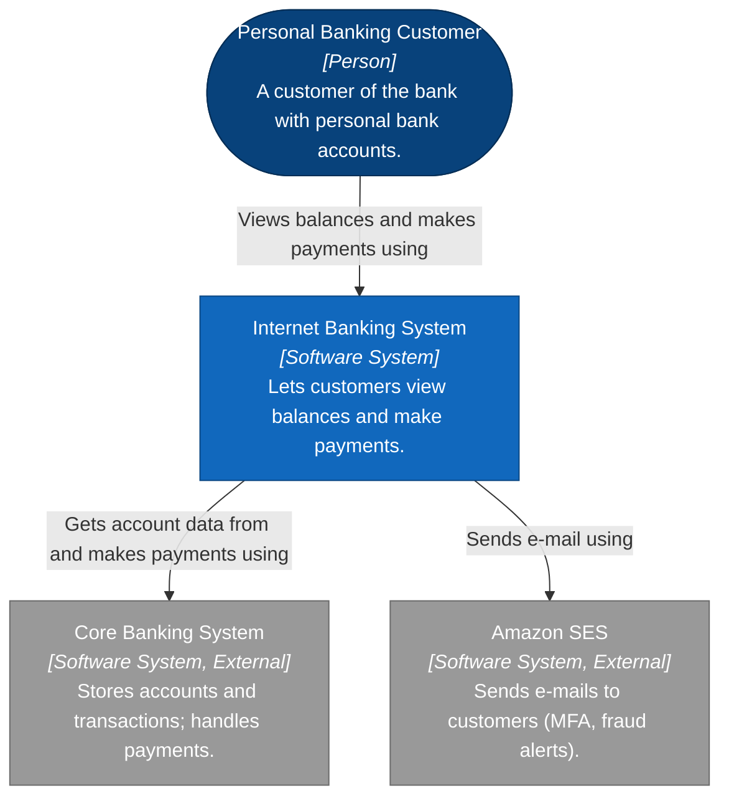
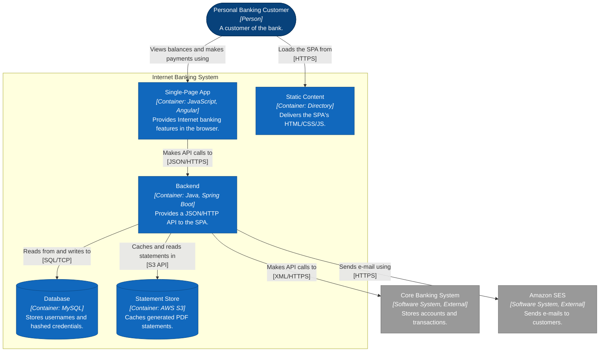
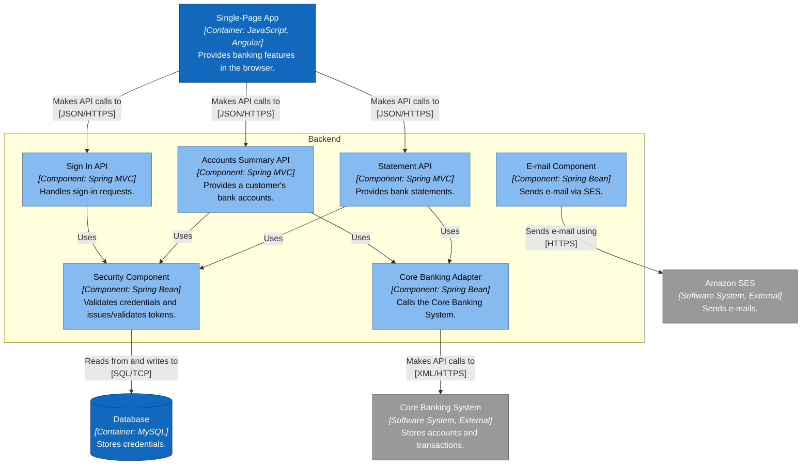
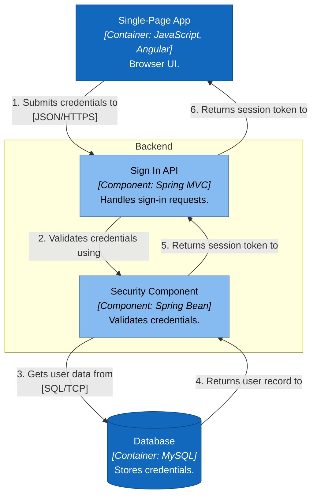
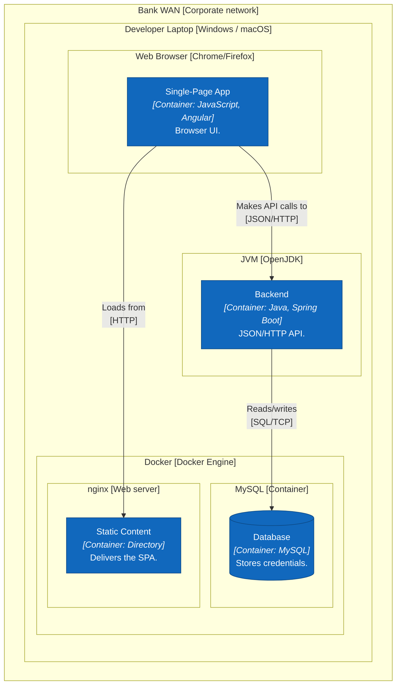
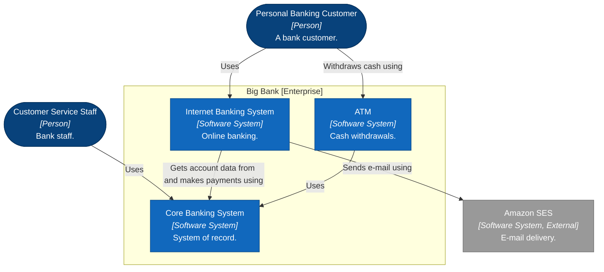

# C4 in Mermaid flowcharts

Mermaid ships an experimental native C4 mode (`C4Context`, `C4Container`, …), but its auto-layout is unreliable and **many renderers draw it incorrectly or not at all**. This skill therefore renders every C4 level as a **styled `flowchart`**. You give up the semantic C4 keywords, but you gain layout you can control and output that renders everywhere Mermaid runs.

The trade you accept: a flowchart only knows "nodes", "edges", and "subgraphs", so **you** carry the C4 method by hand — write the type into each node, label every edge with a preposition, use subgraphs for boundaries, and follow the diagram with a key table. Everything below is a convention layered on plain flowchart syntax; keep it consistent across a diagram set and the flowchart *reads* as C4.

## Table of contents
1. Elements (people, systems, containers, components)
2. Boundaries
3. Relationships
4. Layout, styling & the key
5. Worked example: System Context
6. Worked example: Container
7. Worked example: Component
8. Worked example: Dynamic
9. Worked example: Deployment
10. System Landscape

---

## 1. Elements

Each element is one flowchart node. Put **name / type / (technology) / description** inside the node text, separated by `<br/>`, with the type line in italics. This is the single biggest thing that makes the diagram good — never ship bare named boxes.

Node text pattern (fill in technology only for containers/components):

```
alias["Name<br/><i>[Type: Technology]</i><br/>Short responsibility."]
```

Pick the **node shape by abstraction**, so shape alone signals the kind:

| Abstraction | Shape | Syntax | Type line to write |
|---|---|---|---|
| Person | stadium | `alias(["…"])` | `[Person]` or `[Person, External]` |
| Software system | rectangle | `alias["…"]` | `[Software System]` / `[Software System, External]` |
| Container (app) | rectangle | `alias["…"]` | `[Container: Java, Spring Boot]` |
| Container / component data store | cylinder | `alias[("…")]` | `[Container: MySQL]` |
| Container / component queue/topic | subroutine | `alias[["…"]]` | `[Container: RabbitMQ]` |
| Component | rectangle | `alias["…"]` | `[Component: Spring MVC]` |

Colour — not shape — carries **internal vs. external** and any other differentiation; assign it with a `classDef` (see §4). Use the cylinder for data stores and the subroutine (double-bar) shape for queues/topics — that is how you honour the rule that **queues are data-store containers**, not a "message bus" system. Write the type line yourself for every node; nothing adds it for you.

Examples:

```
customer(["Personal Banking Customer<br/><i>[Person]</i><br/>A customer of the bank."])
ib["Internet Banking System<br/><i>[Software System]</i><br/>Online banking."]
backend["Backend<br/><i>[Container: Java, Spring Boot]</i><br/>JSON/HTTP API."]
db[("Database<br/><i>[Container: MySQL]</i><br/>Stores credentials.")]
queue[["Event Queue<br/><i>[Container: RabbitMQ]</i><br/>Customer update events."]]
```

## 2. Boundaries

A boundary is a `subgraph`. Give it an id and a quoted label; the label should name the thing you are zooming into.

```
subgraph ib["Internet Banking System"]
    spa["…"]
    backend["…"]
end
```

- On a **container diagram**, wrap your containers in a subgraph named after your system. Keep external people/systems *outside* it.
- On a **component diagram**, wrap your components in a subgraph named after the container you are zooming into.
- Use a nested subgraph to overlay non-C4 **groupings** — microservice boundaries, architectural layers, teams, cloud regions. Distinguish a grouping from a system boundary with a `style` fill or a `[type]` suffix in its label, and describe it in the key.

Subgraphs nest, which is what makes deployment diagrams (§9) work. Add a direction inside a subgraph with `direction LR` when its children should stack differently from the parent.

## 3. Relationships

An edge is a labelled arrow. Keep the label a **sentence ending in a preposition** so the arrow direction is unambiguous, and put the protocol on its own line for inter-process calls.

```
customer -->|"Views balances and makes payments using"| spa
spa -->|"Makes API calls to<br/>[JSON/HTTPS]"| backend
```

- **Solid arrow `-->` = synchronous; dashed arrow `-.->` = asynchronous.** This is the flowchart stand-in for C4's line-style convention — if you use it, say so in the key.
- **Arrows are unidirectional**, from initiator to receiver. Collapse a request/response pair into one arrow. Draw two only when the interactions genuinely differ (sync request + async event).
- **Force direction** with the diagram-level `flowchart TB`/`LR` and by ordering nodes; there is no per-edge `Rel_U/Rel_D`. Nudge stubborn nodes with invisible edges (`a ~~~ b`) or by reordering declarations.
- **No protocol on context-level arrows** — keep those high-level; technology appears one level down on the container diagram.

## 4. Layout, styling & the key

**Direction.** `flowchart TB` (top-to-bottom) or `flowchart LR` (left-to-right) is your main layout lever. People usually read best at the top (`TB`).

**Colour by class.** Define classes once and assign them — this is how you encode internal vs. external, existing vs. new, owned vs. third-party. The palette below matches the usual C4 look (dark blue = your system, grey = external, lighter blue = person).

```
classDef person fill:#08427b,color:#fff,stroke:#052e56;
classDef system fill:#1168bd,color:#fff,stroke:#0b4884;
classDef ext    fill:#999,color:#fff,stroke:#6b6b6b;

class customer person;
class spa,backend,db system;
class core,ses ext;
```

**Key.** A flowchart has no built-in C4 key, so every diagram needs one. Put it in a **Markdown table directly beneath the diagram**, not in a `subgraph` inside it. A legend subgraph competes with the real elements for layout, and the renderer will float it wherever it likes; a table sits where you put it, wraps on narrow screens, and stays readable in a diff.

One row per notation you used to *differentiate* things — every colour, shape, and line style:

```markdown
| Notation | Meaning |
|---|---|
| Dark blue | The system in focus |
| Grey | External system, outside your control |
| Stadium shape | Person or role |
| Cylinder | Data store |
| Subroutine shape | Message queue or topic |
| Dashed edge | Asynchronous communication |
| Dashed border | Out of scope for this release |
```

List only the notation this diagram actually uses. If you colour-code for a release ("new in this version"), add the class and give it a row — every colour gets an explanation.

## 5. Worked example — System Context

Relationships carry **no protocol/technology** here — that is deliberate. On a system context diagram, keep relationships high-level; protocols belong on the container diagram (§6).



| Notation | Meaning |
|---|---|
| Dark blue | The system in focus |
| Grey | External system, outside your control |
| Stadium shape | Person |

*Each diagram below carries its own key in real use. They're omitted from the remaining worked examples to keep the notation in focus.*

## 6. Worked example — Container

Wrap your containers in a subgraph named after the system; keep external people/systems outside it. Protocols now appear on the arrows.



## 7. Worked example — Component

Scope is a **single container** (here, the backend). Wrap components in a subgraph named after the container; show only the neighbours the container talks to.



## 8. Worked example — Dynamic

A flowchart won't auto-number relationships, so **number them yourself** in the edge labels — the sequence tells the story. Show only the subset of elements the feature touches. Use `-.->` for any async step.



## 9. Worked example — Deployment

Model infrastructure as **nested subgraphs** (one per deployment node), with the **container instances placed inside them**. Draw **one diagram per environment**. Label each subgraph with the node name and its type/technology.



For production, add subgraphs for the cloud region/services (e.g. AWS Fargate, RDS, S3) and switch protocols to their secure variants (HTTP → HTTPS).

## 10. System Landscape

A landscape is a context diagram without a single system in focus. Show many systems + people, and use a subgraph (styled as a grouping) to mark org/department boundaries.


